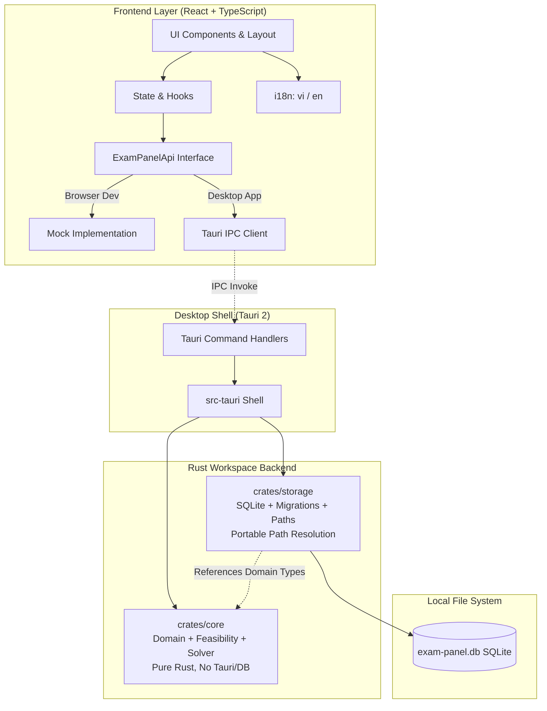
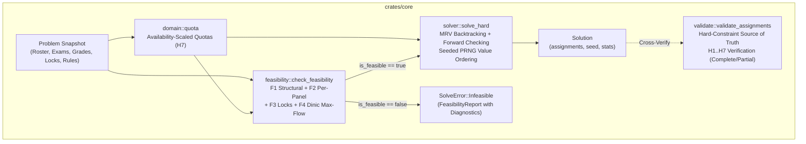
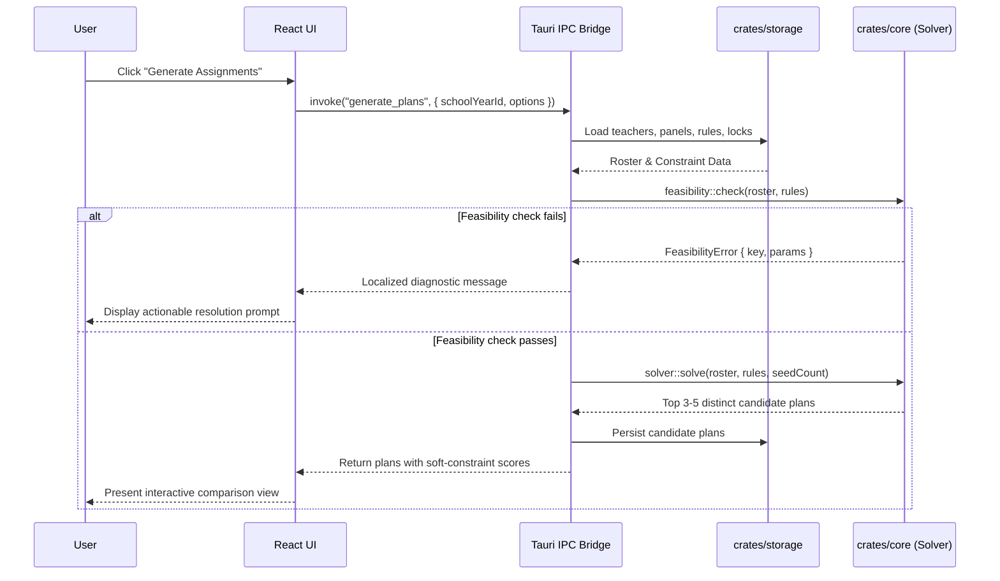
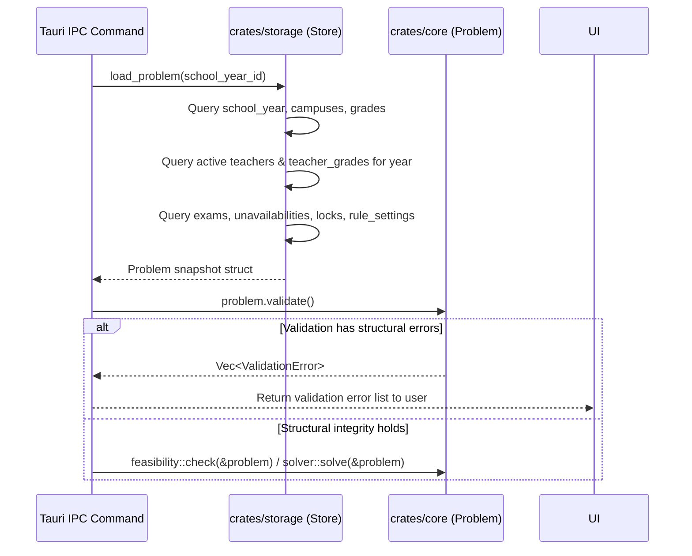
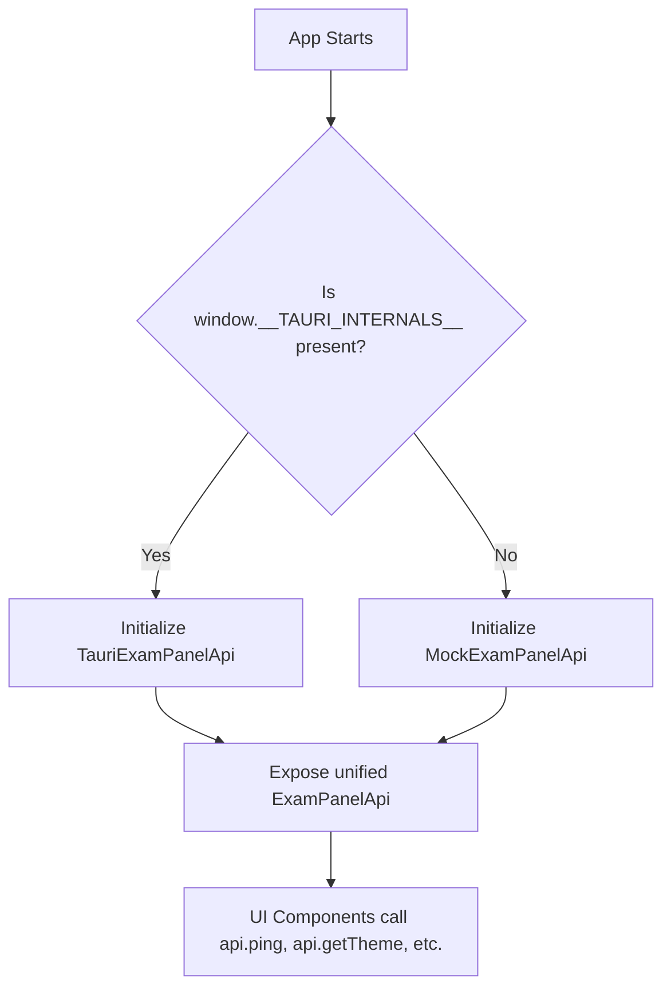

# ExamPanel Architecture Documentation

## 1. System Overview
ExamPanel is architected as a modular, decoupled desktop application separating pure domain algorithms, data persistence, the platform shell, and the user interface.

---

## 2. Layer Responsibilities & Boundaries

### 2.1 `crates/core` (Domain & Algorithm Core)
- **Zero External Shell / DB Dependencies:** Does not depend on `tauri`, `rusqlite`, or any I/O framework. Pure algorithmic domain core.
- **Components:**
  - `domain`: Core immutable domain types (`Teacher`, `Campus`, `Exam`, `Grade`, `PanelKey`, `Lock`, `Assignment`, `Problem`, `TeacherQuota`).
  - `validate`: Source of truth for hard-constraint compliance (H1–H7); validates both complete and partial assignments.
  - `feasibility`: Pre-solve mathematical consistency checks; includes in-house Dinic bipartite max-flow and generates structured `Diagnostic` items with i18n parameter maps.
  - `solver`:
    - Stage 1: Deterministic MRV-directed randomized backtracking with forward checking for 100% hard-constraint satisfaction.
    - Stage 2 (Phase 4): Simulated annealing local search for soft-constraint optimization.

### 2.2 `crates/storage` (Data Access & Persistence)
- **Technology:** `rusqlite` with the `bundled` feature (embedded SQLite engine).
- **Pragmas & Storage Invariants:**
  - Foreign key constraint enforcement (`PRAGMA foreign_keys = ON;`).
  - Standard rollback journal mode (`PRAGMA journal_mode = DELETE;`), guaranteeing the SQLite database remains a single, completely self-contained file without `-wal` or `-shm` sidecars for seamless USB and portable execution.
- **Components:**
  - `paths`: Resolves portable database path (`./data/exam-panel.db` if directory is writable; OS app-data directory fallback otherwise).
  - `migrations`: Embedded schema migration management using incremental SQL scripts bundled with `include_str!`, executed within transactions and tracked via `PRAGMA user_version`. Idempotent across re-runs.
  - `store`: Strongly-typed CRUD operations mapping between SQLite tables and `core` domain structs, with structured error handling (`StorageError` distinguishing `NotFound`, `Constraint`, `Sqlite`, `Io`, and `Serialization`).
  - `seeds`: Idempotent default seeding (`seed_defaults` for grades and UI settings) and complete test/development fixture datasets (`seed_demo`).

### 2.3 `src-tauri` (Desktop Application Shell)
- **Tauri 2 Framework:** Thin platform integration wrapper.
- **Isolation:** Excluded from the default Cargo workspace members (`default-members`) to guarantee that headless CI environments and pure backend development can compile and test without desktop system GUI libraries.
- **Identifier:** `vn.exampanel.app` (configurable in `tauri.conf.json` and `lib.rs`).
- **Commands:** Thin routing layer deserializing IPC arguments, calling `core`/`storage`, and returning JSON payloads.

### 2.4 `ui` (Presentation Layer)
- **Stack:** React 18, TypeScript, Vite, Tailwind CSS, shadcn/ui.
- **Dual Runtime Support:**
  - `ExamPanelApi` interface decouples the UI from Tauri IPC.
  - When running in browser (`pnpm dev`), automatically activates `mock.ts`.
  - When running inside Tauri, automatically activates `tauri.ts` (`@tauri-apps/api/core`).
- **Internationalization (i18n):** `i18next` with default Vietnamese (`vi`) and secondary English (`en`). Zero hard-coded UI strings.
- **Theme Engine:** `light`, `dark`, and `system` modes using semantic CSS tokens (`hsl(var(--...))`).

---

## 3. Data Flow

### 3.1 Plan Generation Flow

### 3.2 Problem Snapshot & Pre-Solve Validation Flow

### 3.3 Dual-Mode API Resolution

---

## 4. Architectural Invariants
1. **Purity of Core:** Any modification to `crates/core` must not introduce file I/O, network I/O, or SQLite dependencies.
2. **Deterministic Feasibility Checks:** Feasibility check failures must always explain *why* the configuration is invalid and name the exact exam, grade, or teacher group causing the conflict.
3. **Data Portability:** Storage location resolution must always prioritize adjacent `./data/` directories when write permissions exist, enabling USB/folder portability without installer lock-in.
4. **Zero String Hardcoding:** Every UI text label, notification, table header, or error message must resolve through `t('path.key')`.
