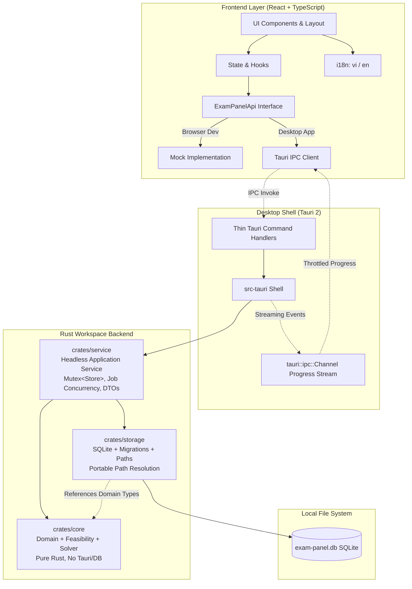
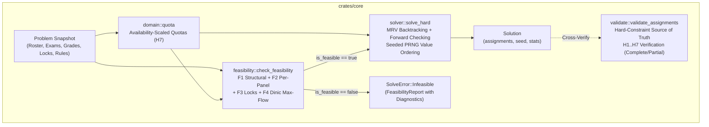
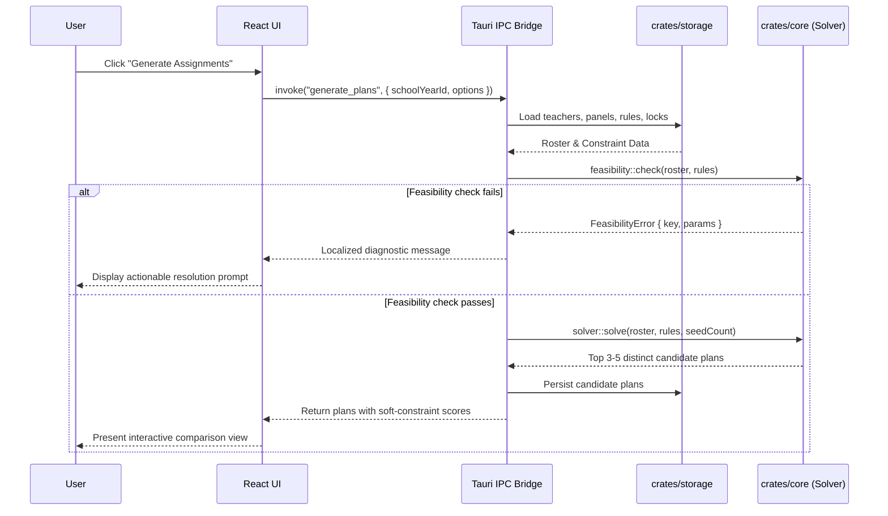
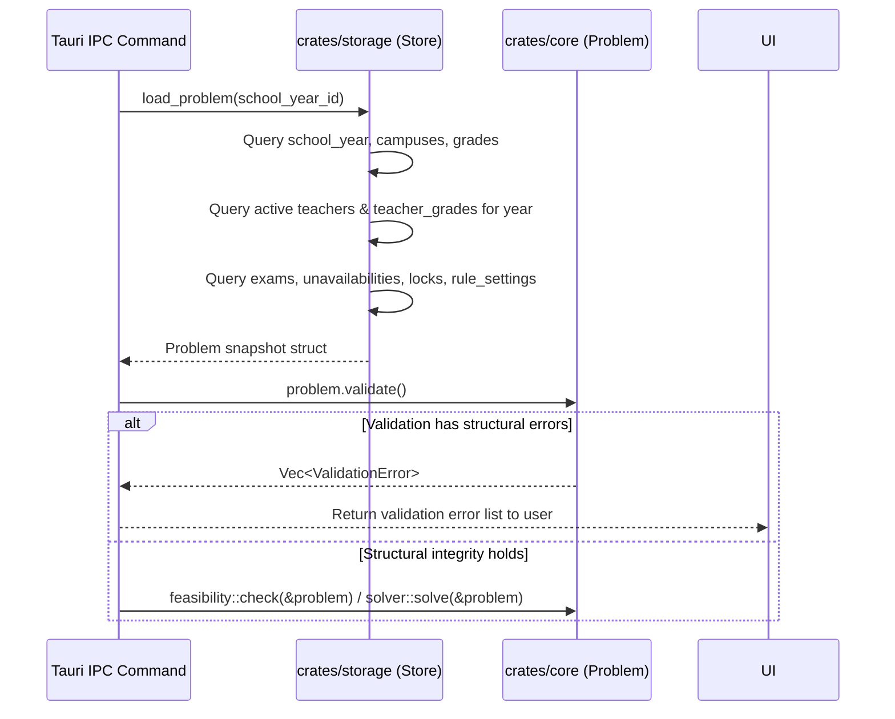
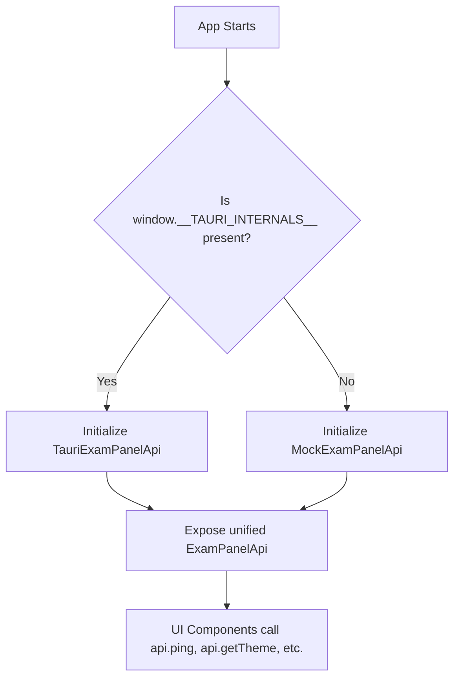
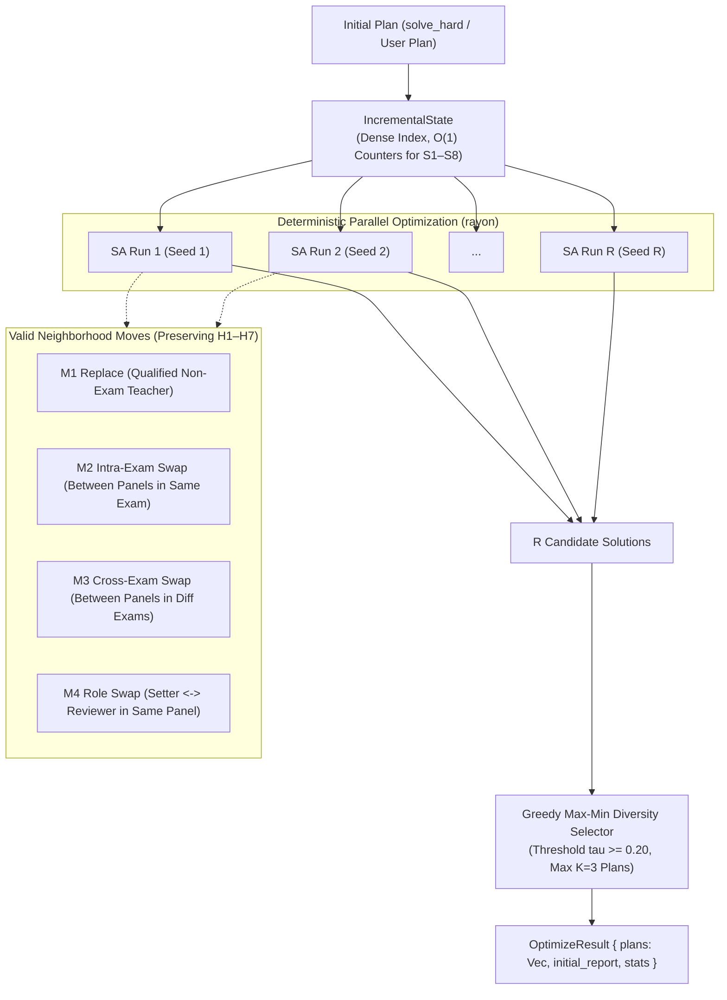

# ExamPanel Architecture Documentation

## 1. System Overview
ExamPanel is architected as a modular, decoupled desktop application separating pure domain algorithms, data persistence, the platform shell, and the user interface.



---

## 2. Layer Responsibilities & Boundaries

### 2.1 `crates/core` (Domain & Algorithm Core)
- **Zero External Shell / DB Dependencies:** Does not depend on `tauri`, `rusqlite`, or any I/O framework. Pure algorithmic domain core.
- **Components:**
  - `domain`: Core immutable domain types (`Teacher`, `Campus`, `Exam`, `Grade`, `PanelKey`, `Lock`, `Assignment`, `Problem`, `TeacherQuota`).
  - `validate`: Source of truth for hard-constraint compliance (H1–H7); validates both complete and partial assignments.
  - `feasibility`: Pre-solve mathematical consistency checks; includes in-house Dinic bipartite max-flow and generates structured `Diagnostic` items with i18n parameter maps.
  - `solver`:
    - Stage 1: Deterministic MRV-directed randomized backtracking with forward checking for 100% hard-constraint satisfaction.
    - Stage 2 (Phase 4): Simulated annealing local search for soft-constraint optimization.



### 2.2 `crates/storage` (Data Access & Persistence)
- **Technology:** `rusqlite` with the `bundled` feature (embedded SQLite engine).
- **Pragmas & Storage Invariants:**
  - Foreign key constraint enforcement (`PRAGMA foreign_keys = ON;`).
  - Standard rollback journal mode (`PRAGMA journal_mode = DELETE;`), guaranteeing the SQLite database remains a single, completely self-contained file without `-wal` or `-shm` sidecars for seamless USB and portable execution.
- **Components:**
  - `paths`: Resolves portable database path (`./data/exam-panel.db` if directory is writable; OS app-data directory fallback otherwise).
  - `migrations`: Embedded schema migration management using incremental SQL scripts bundled with `include_str!`, executed within transactions and tracked via `PRAGMA user_version`. Idempotent across re-runs.
  - `store`: Strongly-typed CRUD operations mapping between SQLite tables and `core` domain structs, with structured error handling (`StorageError` distinguishing `NotFound`, `Constraint`, `Sqlite`, `Io`, and `Serialization`).
  - `seeds`: Idempotent default seeding (`seed_defaults` for grades and UI settings) and complete test/development fixture datasets (`seed_demo`).

### 2.3 `crates/service` (Headless Application Service Layer)
- **Decoupled Business Logic:** Houses all orchestration logic behind desktop commands, completely testable headless without Tauri or GUI dependencies. Included in workspace `default-members`.
- **State Management & Concurrency:**
  - Manages `Store` wrapped in a `std::sync::Mutex` (since SQLite connections are `!Sync`).
  - **Non-Blocking Rule:** The database lock is acquired only to load a pure `Problem` snapshot or commit results. The lock is immediately dropped before compute-heavy solving or optimization begins, allowing concurrent read queries while background optimization runs.
  - **Job Concurrency Guard:** Tracks the active optimization run in `Mutex<Option<Arc<AtomicBool>>>`. If an optimization is already running, subsequent optimization requests are rejected with `AppError` `optimize_busy`.
- **Error Contract:** Standardized serializable `AppError { code: String, params: BTreeMap<String, Value> }`. Maps all underlying storage, validation, feasibility, and concurrency errors into stable, user-translatable error codes.

### 2.4 `src-tauri` (Desktop Application Shell)
- **Tauri 2 Framework:** Thin platform integration wrapper.
- **Isolation:** Excluded from the default Cargo workspace members (`default-members`) to guarantee that headless CI environments and pure backend development can compile and test without desktop system GUI libraries.
- **Commands:** Thin routing layer deserializing IPC arguments, managing `AppService` as state, and delegating execution.
- **Streaming IPC:** Uses Tauri 2 `tauri::ipc::Channel<Progress>` to stream throttled optimization progress events directly to the UI caller without polluting global event channels.
- **Smoke Mode:** Implements `--smoke-test` cli flag for fast headless verification of database initialization, migrations, and service operations without opening a desktop window.

### 2.5 `ui` (Presentation Layer)
- **Stack:** React 18, TypeScript, Vite, Tailwind CSS, shadcn/ui.
- **Dual Runtime Support:**
  - `ExamPanelApi` interface decouples the UI from Tauri IPC.
  - When running in browser (`pnpm dev`), automatically activates `mock.ts` with realistic test fixtures.
  - When running inside Tauri, automatically activates `tauri.ts` (`@tauri-apps/api/core`).
- **Type Bridge:** Strongly typed TypeScript definitions in `src/lib/api/generated/` mirroring Rust DTOs, validated for freshness by CI integration tests.
- **Internationalization (i18n):** `i18next` with default Vietnamese (`vi`) and secondary English (`en`). Zero hard-coded UI strings.
- **Theme Engine:** `light`, `dark`, and `system` modes using semantic CSS tokens (`hsl(var(--...))`).

---

## 3. Data Flow

### 3.1 Plan Generation Flow


### 3.2 Problem Snapshot & Pre-Solve Validation Flow


### 3.3 Dual-Mode API Resolution


### 3.4 Multi-Plan Optimization & Simulated Annealing Architecture


### 3.5 Threading, Locking & Concurrency Model
- `AppService` encapsulates `Store` inside a `std::sync::Mutex<Store>`. Because `rusqlite::Connection` does not implement `Sync`, exclusive access is required when accessing the SQLite file.
- **Locking Rule (Never Hold DB Lock While Computing):**
  1. Acquire lock: `let store = self.store.lock()...`
  2. Snapshot input domain: `let problem = store.load_problem(school_year_id)...`
  3. Release lock: `drop(store);`
  4. Perform CPU-heavy optimization: `run_parallel_optimization(...)` executes without holding the database lock.
  5. Other threads can perform reads (e.g. `list_teachers`, `get_app_info`) concurrently while optimization runs.
  6. On completion, reacquire the lock to persist plans transactionally: `store.save_optimize_result(...)`.

### 3.6 IPC Streaming via Tauri Channels
- Rather than relying on global window-wide events, long-running optimization tasks use Tauri 2's `tauri::ipc::Channel<Progress>`.
- The channel is created per invoke request and passed from `tauri.ts` to `start_optimize`.
- The worker thread streams throttled `Progress` payloads (`run`, `iteration`, `best_score`, `current_score`, `elapsed_ms`) at $\le 10\text{ Hz}$.
- A shared `Arc<AtomicBool>` cancel flag is registered in `AppService::active_job`. When `cancel_optimize()` is called, the atomic flag is set to `true`, prompting the Rayon workers to terminate promptly.

### 3.7 Standardized Error Contract (`AppError`)
All backend failures across storage, domain validation, solver execution, and concurrency control are unified under:
```rust
pub struct AppError {
    pub code: String,
    pub params: BTreeMap<String, serde_json::Value>,
}
```
Mapped error codes include:
- `not_found`: Entity does not exist.
- `duplicate_entry`: Unique constraint violation.
- `teacher_in_use`: Foreign key protection preventing teacher deletion.
- `campus_in_use`: Campus has assigned teachers.
- `foreign_key_violation`, `storage_constraint`, `database_error`: SQLite storage errors.
- `problem_infeasible`: Feasibility check blocked solving.
- `optimize_busy`: An optimization task is already active.
- `cancelled`: User requested cancellation.

Each code corresponds to a localized entry `errors.<code>` in `vi.json` and `en.json`.

### 3.8 TypeScript Type Generation & Contract Verification
- Types are exported to `ui/src/lib/api/generated/types.ts`.
- Freshness is safeguarded by an automated integration test (`crates/service/tests/generate_types.rs`) that asserts the committed TypeScript declarations match the canonical Rust structs. Any discrepancy causes `cargo test` and `pnpm check-all` to fail.

### 3.9 Q-Style Assignment Grid, Import-as-Plan, and Template v2 Pipeline
- **Q-Style Layout & Parity:** The `/assignments` view replicates Coordinator Q's compact grade-block representation with an attached live workload table. Candidate replacement, swap, pin, and forbid operations reuse the unified `ExamPanelApi` contract (`evaluateCandidate`, `setLock`, `deleteLock`).
- **Import as Plan:** Wizard reads Excel sheets or clipboard TSV tables directly into an in-memory `PlanImportPreview`. Name resolution employs a 4-tier pipeline (code -> display name -> full name -> accent/case-folded match). Upon user apply, assignments are saved under `source: 'manual'` with metadata `run_params_json.origin = "import"` without schema alterations.
- **Excel Template v2 & Atomic Import:** Imports parse master data (`Môn`, `Môn đảm nhiệm`, `Giáo viên`, `Phân hiệu`, `Lịch vắng`) in-memory, run non-destructive feasibility simulations, and apply changes atomically within a single SQLite transaction preceded by an automated safety backup (`pre-import`).

---

## 4. Architectural Invariants
1. **Purity of Core:** Any modification to `crates/core` must not introduce file I/O, network I/O, or SQLite dependencies. Pure domain algorithms only.
2. **Deterministic Feasibility Checks:** Feasibility check failures must always explain *why* the configuration is invalid and name the exact exam, grade, or teacher group causing the conflict.
3. **Data Portability:** Storage location resolution must always prioritize adjacent `./data/` directories when write permissions exist, enabling USB/folder portability without installer lock-in.
4. **Zero String Hardcoding:** Every UI text label, notification, table header, or error message must resolve through `t('path.key')`.
5. **Deterministic Optimization:** Given the same `base_seed` and `Budget::Iterations`, parallel multi-run optimization yields identical results across all CPU thread configurations.
6. **Decoupled Service Layer:** `crates/service` must not depend on `tauri`. Tauri commands are thin forwarding wrappers over `AppService`.
7. **Non-Blocking Compute:** The database lock must never be held during feasibility analysis or optimization.
8. **Non-Mutating Import Previews:** Both plan and template import wizards must never execute database writes or generate orphaned records prior to explicit user confirmation.


